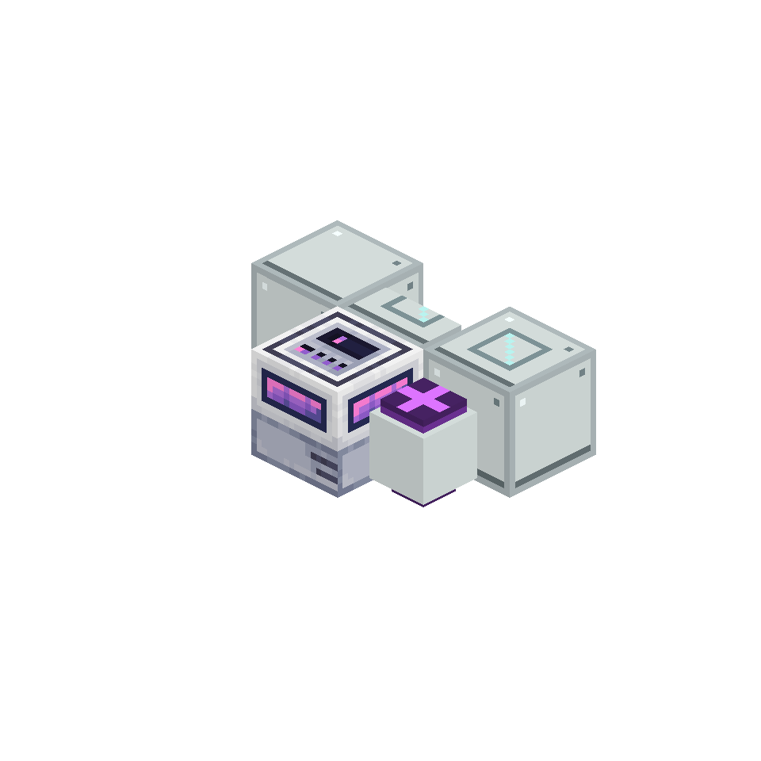

# AE Primitives

Compact AE2-native machines and reusable processing patterns for common automation jobs.



## Machines

Every machine connects directly to a powered ME network, uses one channel and keeps blocked output in its local buffer.

- **ME Fortune Chamber** replaces a Formation Plane and Fortune III Annihilation Plane setup.
- **ME Transformation Chamber** runs AE2 transform recipes.
- **ME Resource Generator** produces cobblestone without placing water or lava in the world.
- **ME Crystal Growth Chamber** grows Certus Quartz and Fluix crystals.
- **ME Compost Chamber** converts vanilla compostables into bone meal at vanilla-equivalent yield.
- **ME Concrete Curing Chamber** cures concrete powder.
- **ME Soil Processor** turns dirt into mud or dries mud into clay.
- **ME Dripstone Reservoir** slowly fills buckets from a retained water or lava source.
- **ME Oxidation Chamber** advances unwaxed copper by one weathering stage.
- **ME Crop Cultivator**, **Tree Nursery** and **Growth Rack** compact common crop, tree and plant farms.
- **ME Apiary Chamber** produces honey bottles or honeycomb from flowers and containers.
- **ME Batch Gate** releases items in complete batches.
- **ME Cooling Plate** handles obsidian and basalt conversion.

The **ME Resonance Foundry** is a 3×2×3 multiblock that processes up to four AE2 transform recipes per cycle through one controller and shared inventory.

## Machine frames

Recipes share three construction tiers:

- **Basic Machine Frame** for simple processing and routing machines.
- **Advanced Machine Frame** for passive resource and heavier world-processing machines.
- **Ultimate Machine Frame** for expensive multiblocks and late-game machines.

Final recipes combine a frame with parts that describe the machine's job.

## Pattern Provider Card

Install a **Pattern Provider Card** in a compatible machine to expose its deterministic jobs to AE crafting. The machine then accepts work from the crafting network instead of running from manually supplied startup items.

Dynamic recipe families are resolved only when AE asks for a concrete output. One tree capability can therefore cover every supported sapling without creating and indexing a permanent encoded pattern for every tree.

## Operation and sequence patterns

AE Primitives can also describe capabilities supplied by ordinary external machines.

An **Operation Pattern** means that the attached machine can perform an operation such as pressing, crushing, filling or deploying. It can represent one exact recipe or the whole operation family. Put it in a normal AE Pattern Provider facing the appropriate machine.

A **Sequence Pattern** describes an ordered process supplied by an optional integration. It expands the sequence into concrete intermediate processing steps, while AE's Crafting CPU remains responsible for ingredient accounting, ordering and dispatch.

This keeps the number of registered patterns proportional to the sequences actually in use. Intermediate patterns are created only for live Sequence Patterns, and disappear when the sequence is removed.

### Process Analyzer

Use the **ME Process Analyzer** on a Pattern Provider to inspect the process graph for that ME network, or inspect a live machine, Machine Space Component, Operation Pattern or Sequence Pattern directly. Machine cards report supported operations, tools and catalysts, external resource contracts and safe parallel capacity without reserving inputs or invoking machine execution. Network graphs mark every operation as:

- **Ready** when a matching provider is available.
- **Busy** when matching providers exist but are currently occupied.
- **Missing** when the network has no provider advertising that operation and recipe.

The graph can be panned and zoomed. Select a node to see the matching providers and their coordinates. Each sequence also receives a revision-bound forecast that nets known intermediate outputs, preserves alternative-input uncertainty, identifies the first structural bottleneck and refuses to invent a completion time when throughput is unknown. Diagnostics reuse the live pattern catalog maintained by provider updates; the analyzer does not scan blocks in the world.

When Ponder is installed, the analyzer also has an interactive tutorial showing how Operation Patterns and Sequence Patterns fit together.

## Optional extensions

Each integration is a separate JAR. Install only the integrations used by the pack.

- [**Kinetics**](create-extension/README.md) adds Create processing machines, operation patterns and real Sequenced Assembly dispatch.
- [**Farmer's Delight**](farmers-delight-extension/README.md) adds ME cutting and cooking with an explicit factory heat port.
- [**Botania**](botania-extension/README.md) adds Pure Daisy, Petal Apothecary, Runic Altar and Mana Pool interfaces.
- [**Powah**](powah-extension/README.md) adds an ME Energizing Chamber and an explicit factory FE port.
- [**PneumaticCraft**](pneumaticcraft-extension/README.md) adds tiered compressed-air cells, pressure import/export ports, network pressure metrics and an ME Pneumatic Assembly Chamber.

### AE Primitives: Kinetics

Create support ships as a separate mod from the same repository. **AE Primitives: Kinetics** requires AE Primitives and Create; the core mod does not load or depend on Create.

The extension provides Create Sequenced Assembly decoding, JEI pattern import, and kinetic AE machines:

- **ME Kinetic Press** runs Create Pressing recipes.
- **ME Crushing Chamber** runs Create Crushing recipes, including probabilistic secondary outputs.
- **ME Catalyst Processing Chamber** runs fan-processing recipes selected by its installed catalyst. Right-click it with a water or lava bucket, soul sand/soil, or a campfire; sneak-right-click with an empty hand to remove the catalyst.

The catalyst chamber is data-driven. Integration packs can map items or item tags to any registered Create fan-processing type. Its window renders the configured fluid or block; definitions without a specialized visual show the exact installed item instead.

All three machines consume a channel and real Create rotational stress. Processing speed follows shaft speed; overstressed networks stop the machine. A Pattern Provider or any item transport can supply the input, and completed outputs are returned directly to ME storage. There is no separate FE conversion or stored “stress” resource.

With Kinetics and JEI installed:

1. Craft an empty Operation Pattern or Sequence Pattern.
2. Open a supported Create recipe in JEI.
3. Click the AE Primitives button beside the recipe.
4. For ordinary processing recipes, click to encode that exact recipe or Shift-click to encode the whole operation family.
5. For Sequenced Assembly, the button imports the complete sequence.

The server validates the selected recipe before encoding the item. Probabilistic sequence result pools are not converted into deterministic AE jobs.

## Usage

1. Connect machines and Pattern Providers to a powered ME network.
2. Feed a machine directly, or install a Pattern Provider Card and request its output through AE crafting.
3. Use AE2 Speed Cards where supported. Each card doubles processing speed; idle power rises with the square of the speed multiplier.
4. If the ME network cannot accept an output, it remains inside the machine.

Both client and server need AE Primitives.

## Requirements

- Minecraft 1.21.1
- NeoForge 21.1.243 or newer
- Applied Energistics 2 19.2.x
- GuideME
- LowDragLib2 2.2.37 or newer
- Java 21

AE Primitives: Kinetics is an optional extension JAR. It requires Create 6.0.10. JEI 19.39 and Ponder are optional client integrations.

Farmer's Delight, Botania, Powah and PneumaticCraft support are optional JARs. Their exact dependencies and usage are documented in their module READMEs above.

## Development

```bash
export JAVA_HOME=/opt/homebrew/opt/openjdk@21
./gradlew verifyAll
```

This is a five-module Gradle build. Core, Kinetics, Farmer's Delight, Botania and Powah each produce an independent JAR.

Generate PNG previews without opening a browser:

```bash
./gradlew exportVisualGallery
```

The declarative model and texture pipeline is documented in [Machine asset pipeline](docs/machine-assets.md). The next machine and integration slices are tracked in the [roadmap](ROADMAP.md).

The README images are real Minecraft renders produced by Minecraft Visual Harness. Their reproducible block groups live in [`docs/demo-scenes`](docs/demo-scenes).

## License

[MIT](LICENSE)
