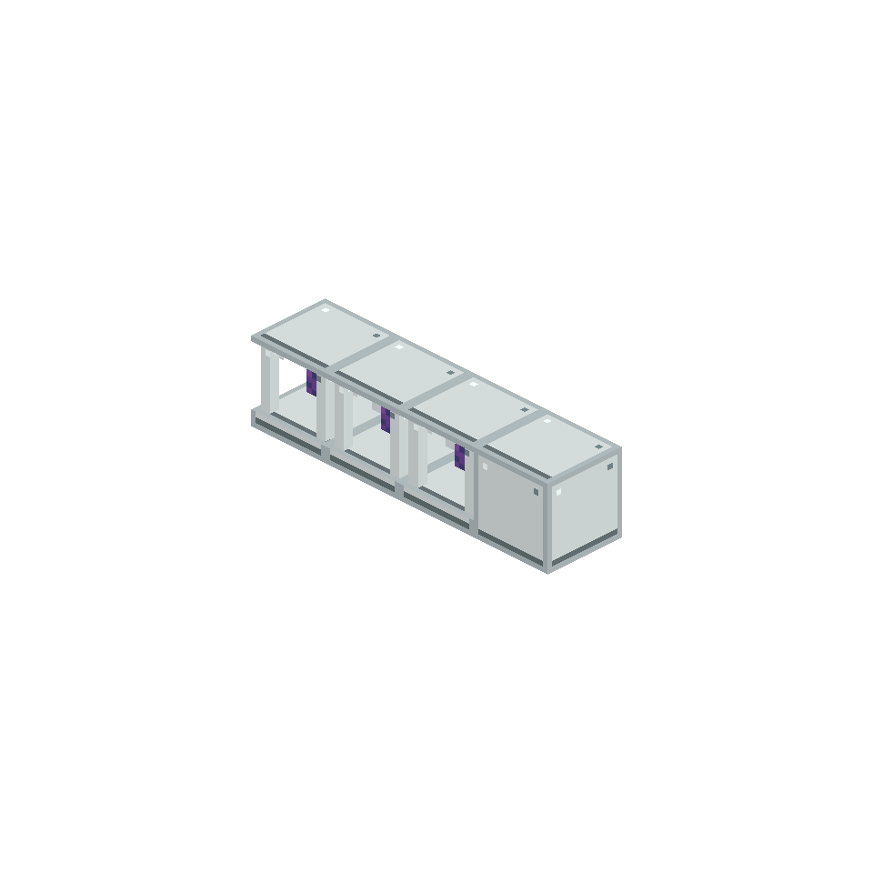

# AE Primitives: Botania

AE-managed interfaces for Botania's world and mana processing.

## Interfaces

- **Pure Daisy Interface** manages Pure Daisy conversions without replacing Botania's world interaction.
- **Petal Apothecary Interface** submits ingredients, water and the seed completion step to a real Petal Apothecary.
- **Runic Altar Interface** manages ingredients, mana and the final Livingrock interaction on a real Runic Altar.
- **Mana Pool Interface** performs mana-infusion recipes through a real Mana Pool.

The interfaces can be packed as Machine Space Components and run inside a Heterogeneous Spatial Factory. Real external Botania blocks remain exclusive resources: one altar, pool or apothecary serves one lane at a time, and waiting work resumes when the resource changes.

## Requirements

- [AE Primitives](../README.md)
- Botania for Minecraft 1.21.1
- Applied Energistics 2 19.2.x
- Minecraft 1.21.1 and NeoForge 21.1

Both client and server need this extension.
