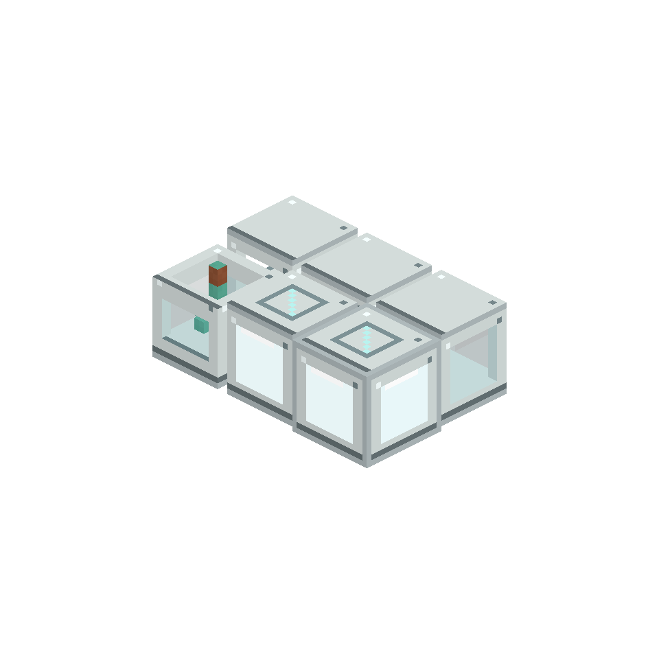

# AE Primitives: Kinetics

Create processing machines and operation patterns for AE Primitives.

## Machines

- **ME Kinetic Press** runs Pressing recipes.
- **ME Crushing Chamber** runs Crushing recipes and preserves probabilistic secondary outputs.
- **ME Catalyst Processing Chamber** runs fan-processing recipes selected by a data-driven catalyst.
- **ME Basin Processor** runs Mixing and Compacting recipes.
- **ME Filling Station** runs Filling and Emptying recipes.
- **ME Deployer**, **Saw**, **Mill** and **Polisher** expose their corresponding Create operations.

Every machine consumes a real Create stress load. Shaft speed controls processing speed, and an overstressed network stops processing. Outputs return to ME storage or remain buffered when storage is blocked.

## Patterns and sequences

Operation Patterns advertise a concrete Create recipe or an operation family through an ordinary AE Pattern Provider. Sequence Patterns import Create Sequenced Assembly and expose its real intermediate steps to AE's crafting service.

With JEI installed, use the AE Primitives button on a supported recipe to encode it. Shift-click encodes the operation family where supported.

## Requirements

- [AE Primitives](../README.md)
- Create 6.0.10
- Applied Energistics 2 19.2.x
- Minecraft 1.21.1 and NeoForge 21.1
- JEI 19.39 is optional for recipe import

Both client and server need this extension.
