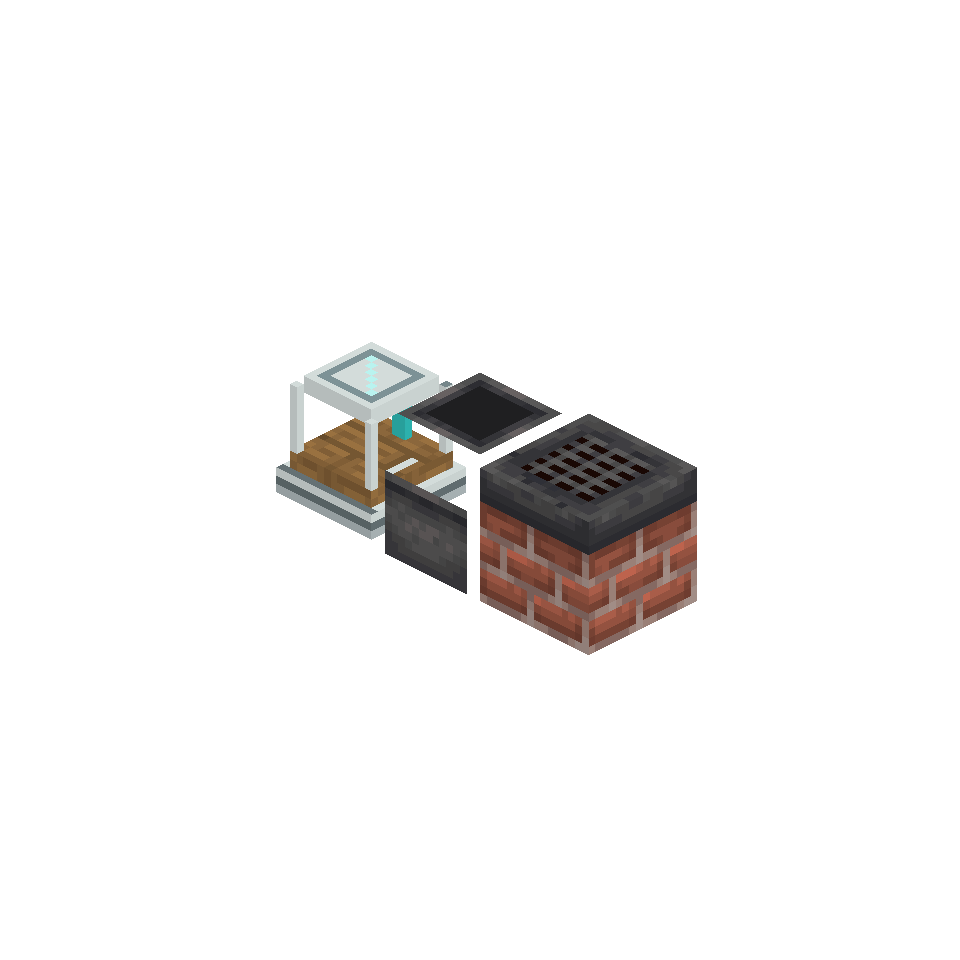

# AE Primitives: Farmer's Delight

AE-managed cutting and cooking for Farmer's Delight.

## Blocks

- **ME Cutting Board** executes Farmer's Delight cutting recipes and keeps tool/container remainders truthful.
- **ME Cooking Pot** executes cooking-pot recipes through the ME network.
- **Cooking Factory Heat Port** supplies explicit world heat to a packaged Cooking Pot inside a Heterogeneous Spatial Factory.

Cooking and cutting keep their inputs and outputs per virtual lane. A packaged machine cannot be removed while a lane still owns input, a remainder or blocked output.

## Requirements

- [AE Primitives](../README.md)
- Farmer's Delight 1.2.8
- Applied Energistics 2 19.2.x
- Minecraft 1.21.1 and NeoForge 21.1

Both client and server need this extension.
