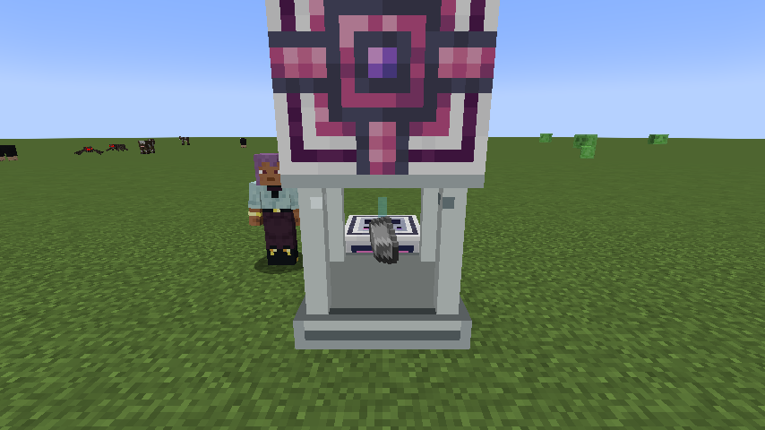

# AE Primitives: Powah

AE-managed Energizing Orb recipes with explicit, linear FE use.

## Blocks

- **ME Energizing Chamber** accepts concrete recipe inputs from ME, pays the real Powah FE cost and buffers completed output when storage is blocked.
- **Basic**, **Niotic** and **Nitro Emitter Modules** control available throughput.
- **Energizing Factory Energy Port** supplies FE to a packaged chamber in a Heterogeneous Spatial Factory.

The active input is rendered in the chamber window. Its beam represents paid energy progress and remains hidden before any FE has been consumed.

Each virtual lane persists its paid energy and pending output. Adding lanes increases energy demand linearly; a blocked output is not recalculated or charged twice.

## Requirements

- [AE Primitives](../README.md)
- Powah 6.2.x
- Applied Energistics 2 19.2.x
- Minecraft 1.21.1 and NeoForge 21.1

Both client and server need this extension.
